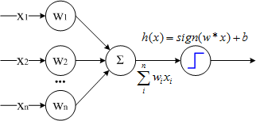

# 单层感知机

**单层感知机**和多层感知机\(MLP\)是最基础的神经网络结构。将卷积操作创新的加入到神经网络结构形成了卷积神经网络，卷积神经网络给现代人工智能注入了活力。感知机网络和卷积网络\(CNN\)都属于前馈型网络\(FeedForward Network\)。

**单层感知机**是二分类的线性分类模型，输入是被感知数据集的特征向量，输出时数据集的类别{+1,-1}。**单层感知机**的函数近似非常有限，其决策边界必须是一个超平面，严格要求数据是线性可分的。支持向量机，用核函数修正了感知器的不足，将特征向量有效的映射到更高维的空间使得样本成为线性可分的数据集。

本节尝试揭开**单层感知机**的神秘面纱，尝试用数据给出模型和解释。

## 1 单层感知机的模型

**单层感知机**目标是将被感知数据集划分为两类的分离超平面，并计算出该超平面。**单层感知机**是二分类的线性分类模型，输入是被感知数据集的特征向量，输出时数据集的类别{+1,-1}。感知器的模型可以简单表示为：

$$
[f(x)=sign(w.x+b)
$$

该函数称为**单层感知机**，其中w是网络的N维权重向量，b是网络的N维偏置向量, w.x是w和x的内积，w和b的N维向量取值要求在实数域。

sign函数是感知机的早期激活函数，后面又演化出一系列的激活函数。激活函数一般采用非线性激活函数，以增强网络的表达能力。常见的激活函数有：sign, sigmoid,tanh,ReLU等。

$$
sign(x) = \begin{cases}
+1 &x >0\\
+0 &x < 0
\end{cases}
$$

为**单层感知机**与逻辑回归的差别就是感知机激活函数是sign，逻辑回归的激活函数是sigmoid。sign\(x\)将大于0的分为1，小于0的分为-1；sigmoid将大于0.5的分为1，小于0.5的分为0。因此sign又被称为单位阶跃函数，逻辑回归也被看作是一种概率估计。

## 2 单层感知机的训练

如果数据集可以被一个超平面完全划分，则称该数据集是线性可分的数据集，否则称为线性不可分的数据集。对于线性可分的数据集，单层感知机基本任务是寻找一个线性可分的超平面$S：{w_x+b=0}$, 该超平面能够将所有的正类和负类完全划分到超平面的两侧。对于线性不可分的数据集，\*单层感知机_由于模型无法稳定收敛，而无法处理。

* 给出N个线性可分的数据集$${(x_1,y_1),(x_2,y_2),...(x_n,y_n)}$$,其中输出向量$$y_i={-1,1}$$ ，输入特征向量$$x_i={x_1,x_2,...,x_n}$$
* 学习率 η(0<η<1) ,模型选择$$f(x)=sign(w*x+b)$$
* 使用Loss函数和梯度下降法求解w和b向量;
* 对所有数据训练完成后，如果至少有一个数据训练错误，则要对权值进行重新训练，直到对所有数据训练正确，结束训练。

## 3 单层感知机的使用

外部系统将输入数据变换成**单层感知机**接受的值域；外部系统将合法的输入数据输入到**单层感知机**；**单层感知机**利用已有模型计算结果；**单层感知机**输出数据；外部系统接收输出数据并使用。

## 4 单层感知机的缺陷

### 4.1 XOR 问题

1969 年马文·明斯基将感知机兴奋推到最高顶峰。他提出了著名的 XOR 问题和感知器数据线性不可分的情形。此后,神经网络的研究将处于休眠状态,直到上世纪80年代。

## 参考文献

- [1] Ian Goodfellow, Yoshua Bengio. [Deep Learning](http://www.deeplearningbook.org/). MIT Press. 2016.
- [2] 焦李成等. 深度学习、优化与识别. 清华大学出版社. 2017.
- [3] 佩德罗·多明戈斯. 终极算法-机器学习和人工智能如何重塑世界. 中信出版社. 2018.
- [4] 雷.库兹韦尔. 人工智能的未来-揭示人类思维的奥秘.  浙江人民出版社. 2016.

