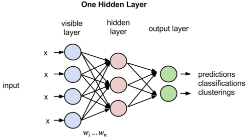

# 深度学习-32:多层感知机原理

> [CSDN专栏: 机器学习&深度学习(理论/实践)](https://blog.csdn.net/column/details/27839.html)

## 1 MLP的模型

多层感知机（MLP，Multilayer Perceptron）也叫人工神经网络（ANN，Artificial Neural Network），除了输入输出层，它中间可以有多个隐层，最简单的MLP只含一个隐层，即三层的结构.

多层感知器(multilayer Perceptron，MLP)是指可以是感知器的人工神经元组成的多个层次。MPL的层次结构是一个有向无环图。通常，每一层都全连接到下一层，某一层上的每个人工神经元的输出成为下一层若干人工神经元的输入。MLP至少有三层人工神经元。

输入层(input layer)由简单的输入人工神经元构成。每个输入神经元至少连接一个隐藏层(hidden layer)的人工神经元。隐藏层表示潜在的变量；层的输入和输出都不会出现在训练集中。隐藏层后面连接的是输出层(output layer)。

隐藏层中的人工神经元，也称单元(units)通常用非线性激励函数，如双曲正切函数(hyperbolic tangent function)和逻辑函数(logistic function)，公式如下所示：

$f(x)=tanh(x)$

$f(x)=1/(1+e^{-x})$

我们的目标是找到成本函数最小化的权重值。通常，MLP的成本函数是残差平方和的均值，计算公式如下所示，其中的 mm 表示训练样本的数量：

## 2 MLP的训练方法

需要训练的模型参数(parameters)：

- num_hidden:隐藏层节点数目
- activation func:隐藏层/输出层节点的激发函数
- weights/biases:连接权重/偏置

构造成本函数:  
  
反向传播（backpropagation）算法经常用来连接优化算法求解成本函数最小化问题，比如梯度下降法。这个算法名称是反向（back）和传播（propagation）的合成词，是指误差在网络层的流向。理论上，反向传播可以用于训练具有任意层、任意数量隐藏单元的前馈人工神经网络，但是计算能力的实际限制会约束反向传播的能力。

反向传播与梯度下降法类似，根据成本函数的梯度变化不断更新模型参数。与我们前面介绍过的线性模型不同，神经网络包含不可见的隐藏单元；我们不能从训练集中找到它们。如果我们找不到这些隐藏单元，我们也就不能计算它们的误差，不能计算成本函数的梯度，进而无法求出权重值。如果一个随机变化是某个权重降低了成本函数值，那么我们保留这个变化，就可能同时改变另一个权重的值。这种做法有个明显的问题，就是其计算成本过高。而反向传播算法提供了一种有效的解决方法。

## 3 MLP的学习方法

## 系列文章

- [CSDN专栏: 机器学习&深度学习(理论/实践)](https://blog.csdn.net/column/details/27839.html)
- [Gihutb专栏: 机器学习&深度学习(理论/实践)](https://github.com/media-tm/MTOpenML)

## 参考文献

- [1] Ian Goodfellow, Yoshua Bengio. [Deep Learning](http://www.deeplearningbook.org/). MIT Press. 2016.
- [2] 焦李成等. 深度学习、优化与识别. 清华大学出版社. 2017.
- [3] 佩德罗·多明戈斯. 终极算法-机器学习和人工智能如何重塑世界. 中信出版社. 2018.
- [4] 雷.库兹韦尔. 人工智能的未来-揭示人类思维的奥秘.  浙江人民出版社. 2016.