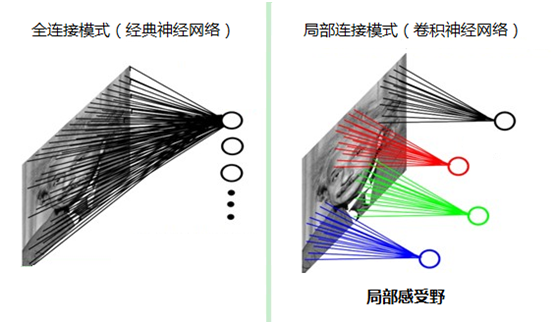
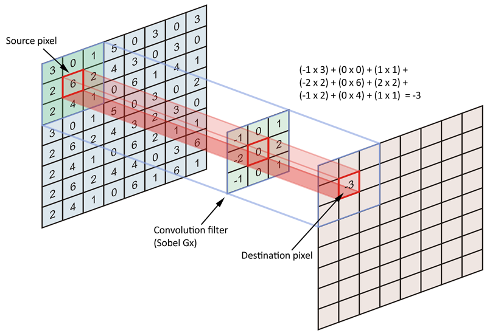
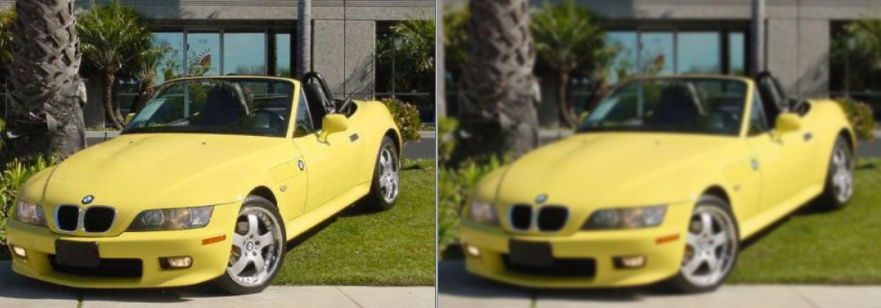

# 深度学习-33:卷积神经网络，卷积的特性和作用

卷积神经网络是近年发展起来，并引起广泛重视的一种高效识别方法。20世纪60年代，Hubel和Wiesel在研究猫脑皮层中用于局部敏感和方向选择的神经元时发现其独特的网络结构可以有效地降低反馈神经网络的复杂性，继而提出了卷积神经网络(Convolutional Neural Networks, CNN)。K.Fukushima在1980年提出的新识别机是卷积神经网络的第一个实现网络。Alexander和Taylor提出的“改进认知机”，该方法综合了各种改进方法的优点并避免了耗时的误差反向传播。

## 1 卷积的生物学模拟

CNN主要用来识别位移、缩放及其他形式扭曲不变性的二维图形。由于CNN的特征检测层通过训练数据进行学习，所以在使用CNN时，避免了显示的特征抽取，而隐式地从训练数据中进行学习；再者由于同一特征映射面上的神经元权值相同，所以网络可以并行学习，这也是卷积网络相对于神经元彼此相连网络的一大优势。卷积神经网络以其局部权值共享的特殊结构在语音识别和图像处理方面有着独特的优越性，其布局更接近于实际的生物神经网络，权值共享降低了网络的复杂性，特别是多维输入向量的图像可以直接输入网络这一特点避免了特征提取和分类过程中数据重建的复杂度。

## 2 卷积的特性

CNN的基本结构包括两层，其一为特征提取层，每个神经元的输入与前一层的局部接受域相连，并提取该局部的特征。一旦该局部特征被提取后，它与其它特征间的位置关系也随之确定下来；其二是特征映射层，网络的每个计算层由多个特征映射组成，每个特征映射是一个平面，平面上所有神经元的权值相等。特征映射结构采用影响函数核小的sigmoid函数作为卷积网络的激活函数，使得特征映射具有位移不变性。此外，由于一个映射面上的神经元共享权值，因而减少了网络自由参数的个数。卷积神经网络中的每一个卷积层都紧跟着一个用来求局部平均与二次提取的计算层，这种特有的两次特征提取结构减小了特征分辨率。

### 2.1 局部感知

在图像处理中，假如将1000×1000的图像向量作为输入卷积神经网络(Convolutional Neural Networks, CNN)，如果隐含层数目与输入层参数相同，则输入层到隐含层的参数数据为1000000×1000000=10^12，轻松到达普通计算机的算力上线，基本没法训练。针对这个困境卷积神经网络(CNN)给出了局部感知野(其实就是卷积核)的解决方案，降低了模型的参数数量。

局部感知野(其实就是卷积核)的解决方案来自人类视觉系统结构的启发，视觉皮层的神经元就是局部接受信息的(即这些神经元只响应某些特定区域的刺激)。生物神经元其实没有必要对全局图像进行感知，只需要对局部进行感知，然后在更高层将局部的信息综合起来就得到了全局的信息。生物神经元对外界的认知是从局部到全局的，而图像的空间联系也是局部的像素联系较为紧密，而距离较远的像素相关性则较弱。如下图所示：左图为全连接，右图为局部连接。

### 2.2 参数共享

局部连接中，每个神经元都对应100个参数，一共1000000个神经元，如果这1000000个神经元的100个参数都是不同的话，参数量又爆炸咯。但是1000000个神经元共享这100个参数，则参数量仅仅为100个。

从生物神经元的角度看，卷积核被认为是特征提取器，特征提取器与位置无关。所以参数共享是可行的。用一个卷积核不改变其内权系数的情况下卷积处理整张图片,对于这个图像上的所有位置，我们使用同一个卷积核提取图像特征。整张图片在使用同一个卷积核内的参数，比如一个3*3*1的卷积核，这个卷积核内9个的参数被整张图共享，而不会因为图像内位置的不同而改变卷积核内的权系数。

> As stated earlier, all the units in a feature map share the same set of 25 weights and the same bias so they detect the same feature at all possible locations on the input.

《Gradient-Based Learning Applied to Document Recognition》原始论文中也给出了共享权值的理解,每种(个)Filter学习一种Feature,同一种Filter权值当然是共享,所以就每个卷积层需要很多种Filter,也就是Depth来学习很多种不同的特征。

### 2.3 提取特征

从生物神经元的角度看，卷积核被认为是特征提取器，特征提取器与位置无关。了解OpenCV图像处理应用的都知道，卷积核(滤波器/Filter)可以提取图像的特征。OpenCV函数库中，Gabor函数可以在频域不同尺度、不同方向上提取相关的特征。另外Gabor函数与人眼的生物作用相仿，所以经常用作纹理识别上，并取得了较好的效果，Gabor变换是短时Fourier变换中当窗函数取为高斯函数时的一种特殊情况。Gabor变换的本质实际上还是对二维图像求卷积。

### 2.4 卷积(Convolution)

OpenCV中边缘检测的各种算子和滤波器, 可以用于图像加噪声、去噪声、边缘检测或特征提取等。例如边缘检测滤波器:Canny算子,Sobel算子,Laplace算子和Scharr滤波器。滤波器的本质就是卷积操作。对于图像而言，然后在原图像上从左到右，从上到下移动滤波器(Filter)，把对应位置上的元素相乘后加起来，得到最终的结果。卷积操作的计算过程如下图所示。

例如高斯模糊滤波器的处理图像的效果图。

### 2.5 池化(Pooling)

空间池化(也称为子采样或下采样)可降低每个特征映射的维度，并保留最重要的信息。空间池化有几种不同的方式：最大值，平均值，求和等。最大池化(max-pooling)保留了每一小块内的最大值，相当于保留这一块最佳的匹配结果。通过加入池化层，图像缩小了，能很大程度上减少计算量，降低机器负载。

池化的作用是逐步减少输入的空间大小[4]。具体来说有以下四点：

- 使输入（特征维度）更小，更易于管理
- 减少网络中的参数和运算次数，因此可以控制过拟合
- 使网络对输入图像微小的变换、失真和平移更加稳健（输入图片小幅度的失真不会改池化的输出结果 —— 因为我们取了邻域的最大值/平均值）。
- 可以得到尺度几乎不变的图像（确切的术语是“等变”）。这是非常有用的，这样无论图片中的物体位于何处，我们都可以检测到。

### 2.6 激活函数ReLU (Rectified Linear Units)

常用的激活函数有sigmoid、tanh、relu等等，前两者sigmoid/tanh比较常见于全连接层，后者ReLU常见于卷积层。回顾一下前面讲的感知机，感知机在接收到各个输入，然后进行求和，再经过激活函数后输出。激活函数的作用是用来加入非线性因素，把卷积层输出结果做非线性映射。

ReLU 是一个针对元素的操作（应用于每个像素），并将特征映射中的所有负像素值替换为零。ReLU 的目的是在卷积神经网络中引入非线性因素，因为在实际生活中我们想要用神经网络学习的数据大多数都是非线性的（卷积是一个线性运算 —— 按元素进行矩阵乘法和加法，所以我们希望通过引入 ReLU 这样的非线性函数来解决非线性问题）。

### 2.7 全连接层(Fully connected layers)

完全连接层是一个传统的多层感知器，它在输出层使用 softmax 激活函数(可以使用其他分类器，比如SVM等)。完全连接这个术语意味着前一层中的每个神经元都连接到下一层的每个神经元。全连接层在整个卷积神经网络中起到分类器的作用，即通过卷积、激活函数、池化等深度网络后，再经过全连接层对结果进行识别分类。首先将经过卷积、激活函数、池化的深度网络后的整体串联起来。

## 3 网络模型

### 3.1 最简模型

### 3.2 优化技术

### 3.3 模型可视化

## 4 CNN的演进

- 1980s至2012年：从90年代到2010年代早期，卷积神经网络都处于孵化阶段。随着数据量增大和计算能力提高，卷积神经网络的能力和应用范围日益扩大。
- LeNet模型: Yann LeCun教授于1998年在论文Gradient-based learning applied to document recognition中提出的，它是第一个成功应用于数字识别问题的卷积神经网络。
- AlexNet模型：2012年ImageNet大规模图像识别挑战赛(ILSVRC)的冠军模型，作者是Krizhevsky。这次突破客观上推动了卷积神经网络的复兴。
- ZF Net模型：2013年ImageNet大规模图像识别挑战赛(ILSVRC)的冠军模型，作者是Matthew Zeiler和Rob Fergus。创新亮点是通过调整过架构超参数改进了AlexNet模型。
- GoogleNet模型：2014年ImageNet大规模图像识别挑战赛(ILSVRC)的冠军模型，作者是Szegedy等。创新亮点是发明了Inception Module，它大幅减少了网络中的参数数量，GoogleNet参数四百万，而AlexNet的六千万。
- VGGNet模型：2014年ImageNet大规模图像识别挑战赛(ILSVRC)的亚军模型。创新亮点是展示了网络的深度(层次数量)是良好表现的关键因素。
- ResNet模型：2015年ImageNet大规模图像识别挑战赛(ILSVRC)的冠军模型，作者是何凯明等。创新亮点是残差网络，其实这个网络的提出本质上还是要解决层次比较深的时候无法训练的问题。ResNet已经有152层。
- DenseNet模型：2016年ImageNet大规模图像识别挑战赛(ILSVRC)的冠军模型，作者是Gao Huang等。创新亮点是DenseNet每一层都直接与其他各层前向连接。DenseNet已经在五个高难度的物体识别基础集上，显式出非凡的进步。

## 参考文献

- [1] Ian Goodfellow, Yoshua Bengio. [Deep Learning](http://www.deeplearningbook.org/). MIT Press. 2016.
- [2] 焦李成等. 深度学习、优化与识别. 清华大学出版社. 2017.
- [3] 佩德罗·多明戈斯. 终极算法-机器学习和人工智能如何重塑世界. 中信出版社. 2018.
- [4] 雷.库兹韦尔. 人工智能的未来-揭示人类思维的奥秘.  浙江人民出版社. 2016.
