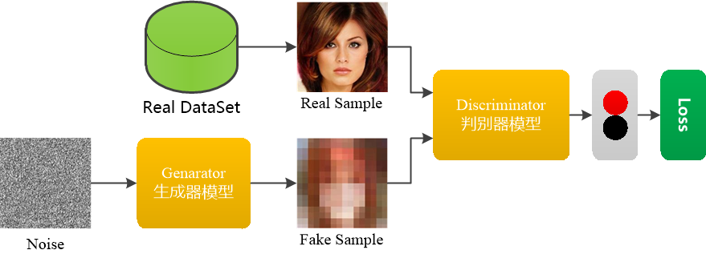

# 深度学习-52: 生成式对抗网络GAN(原理、模型和演进)

一般的学习模型都是基于一个假设的随机分布，然后通过训练真实数据来拟合出模型。网络模型复杂并且数据集规模也不小，这种方法简直就是凭借天生蛮力解决问题。Goodfellow认为正确使用数据的方式，先对数据集的特征信息有insight之后，再干活。在2014年，Goodfellow等提出生成式对抗网络GAN(Generative adversarial networks)。

Goodfellow的原始论文，请参考:[Generative Adversarial Networks(GAN)](https://arxiv.org/abs/1406.2661)。

GAN网络由一个生成器和一个判别器构成。生成器和判别器使用多层感知机。GAN网络的架构，如下图所示。
。

## 1 GAN模型的创新

GAN模型时通过对抗过程来估计生成模型的新框架。在GAN模型框架中，生成模型与判别模型进行非合作零和博弈。生成模型可以被认为类似于造假者团队，试图生产虚假货币并在没有检测的情况下使用它，而判别模型则是类似于警察，试图检测假币。这场比赛中的比赛开始了两个团队都在改进他们的方法，直到伪造品与真品无法区分用品。

GAN模型的的主要创新:

- 拥有生成网络G和辨别网络D，生成模型G的思想是将一个噪声包装成一个逼真的样本，判别模型D则需要判断送入的样本是真实的还是假的样本;
- 生成网络G和辨别网络D使用独立学习模型，辨别模型D对样本的判别能力不断上升，生成模型G的造假能力也不断上升;
- GAN的优化是一个极小极大博弈问题，最终的目的是Generator的输出Discriminator时很难判断是真实or伪造的，即极大化的判断能力，极小化将的输出判断为伪造的概率。

## 2 GAN模型的结构

生成对抗网络(GAN)的结构:

- GAN由一个生成器和一个判别器构成;
- GAN的生成器捕捉真实数据样本的潜在分布, 并生成新的数据样本;
- GAN的判别器是一个二分类器, 判别输入是真实数据还是生成的样本;
- GAN的生成器和判别器均可以使用深度学习模型;
- GAN的优化过程是极小极大博弈(Minimax game)问题, 优化目标是达到纳什均衡。

### 2.1 模型构建

生成对抗网络(GAN)基于博弈模型，其中生成模型(Generator)必须与其对手判别模型(Discriminator)竞争。生成模型直接生成假样本, 判别模型尝试区分生成器生成的样本(假样本)和训练数据中抽取的样本(真样本)。生成对抗网络(GAN)是一种生成模型，由生成器Generator和辨别器Discriminator组成。生成模型(Generator)尝试了解真实数据样本的特征分布, 并生成新的数据样本。判别模型(Discriminator)一个二分类器, 判别输入是真实数据还是生成的样本。生成模型(Generator)和判别模型(Discriminator)均可以使用感知机或者深度学习模型。优化过程是极小极大博弈(Minimax game)问题, 优化目标是达到纳什均衡，即直到判别模型(Discriminator)无法识别生成模型(Generator)生成的假样本是真是假。

### 2.2 训练模型

生成对抗网络(GAN)基于博弈模型，由生成器(Generator)和辨别器(Discriminator)组成。生成器(Generator)的假样本和训练数据的真样本输入到辨别器(Discriminator)。在训练的过程中，对于真实数据，判别器尝试向其分配一个接近1的概率(smooth参数将labels设为略小于1的值，如0.9)。生成对抗网络(GAN)使用Tensorlow提供的
tf.nn.sigmoid_cross_entropy_with_logits(logits=logits, labels=labels)函数可以计算代价。

对于真实数据，我们使用label=1计算代价函数来训练判别器，其代价函数的计算方法为：

```python
loss = tf.nn.sigmoid_cross_entropy_with_logits
d_loss_real = loss(d_logits_real, labels=tf.ones_like(d_logits_real)*(1-smooth))
```

对于生成器，我们使用label=0计算代价函数来训练判别器，其代价函数的计算方法为：

```python
loss = tf.nn.sigmoid_cross_entropy_with_logits
d_loss_fake = loss(d_logits_fake, labels=tf.zeros_like(d_logits_fake))
```

所以判别器的代价函数为：d_loss = d_loss_real + d_loss_fake

生成器尝试做相反的事情，它经训练尝试输出能使辨别器分配接近概率1的样本。生成器的代价函数为

```python
loss = tf.nn.sigmoid_cross_entropy_with_logits
g_loss = loss(d_logits_fake, labels=tf.ones_like(d_logits_fake))
```

GANs和很多其他模型不同，GANs在训练时需要同时运行两个优化算法，我们需要为discriminator和generator分别定义一个优化器，一个用来来最小化discriminator的损失，另一个用来最小化generator的损失。即loss = d_loss + g_loss


黑色虚线是真实数据的高斯分布，绿色的线是生成网络学习到的伪造分布，蓝色的线是判别网络判定为真实图片的概率，标x的横线代表服从高斯分布x的采样空间，标z的横线代表服从均匀分布z的采样空间。从上图中可以看出，经过多次迭代，可以看出生成模型(Generator)学习了从z的空间到x的空间的映射关系。简单来说就是生成模型(Generator)和原始数据集的特征近似相同，训练工作就结束了，生成模型(Generator)生成的数据已经假假真真不可辨识了。

## 3 GAN模型的演进

Google论文：[Are GANs Created Equal? A Large-Scale Study(Google)](https://arxiv.org/abs/1711.10337)。论文中使用了minimax损失函数和用non-saturating损失函数的GAN，分别简称为MM GAN和NS GAN，对比了WGAN、WGAN GP、LS GAN、DRAGAN、BEGAN等GAN模型变体，发现性能大同小异。这个结论是选择困难症的福音呀。

### 3.1 CGAN

原始GAN不要求一个假设的数据分布，即不需要formulate p(x)，而是使用一种分布直接进行采样sampling，从而真正达到理论上可以完全逼近真实数据。为了解决GAN太过自由这个问题，CGAN提出了一种带条件约束的GAN，在生成模型(G)和判别模型(D)的建模中均引入条件变量y，使用额外信息y对模型增加条件，可以指导数据生成过程。

- 论文：[Conditional Generative Adversarial Nets(CGAN)](https://arxiv.org/pdf/1411.1784);
- 源码：https://github.com/znxlwm/tensorflow-MNIST-cGAN-cDCGAN

### 3.2 GCGAN

DCGAN是继GAN之后比较好的改进，提升了GAN训练的稳定性以及生成结果质量。DCGAN为GAN的训练提供了一个很好的网络拓扑结构,表明生成的特征具有向量的计算特性。

- 论文：[Deep Convolutional GANs(DCGAN)](http://arxiv.org/abs/1511.06434)
- 源码：https://github.com/carpedm20/DCGAN-tensorflow

### 3.3 WGAN

WGAN主要从损失函数的角度对GAN做了改进，损失函数改进之后的WGAN即使在全链接层上也能得到很好的表现结果，WGAN对GAN的改进主要有:判别器最后一层去掉sigmoid; 生成器和判别器的loss不取log。

- 论文：[Wasserstein GAN(WGAN)](https://arxiv.org/abs/1701.07875);
- 源码：https://github.com/Zardinality/WGAN-tensorflow

### 3.4 WGAN-GP

WGAN-GP是WGAN之后的改进版，主要改进了连续性限制的条件。WGAN-GP提出了一种新的lipschitz连续性限制手法—梯度惩罚，解决了训练梯度消失梯度爆炸的问题；比标准WGAN拥有更快的收敛速度，并能生成更高质量的样本；提供稳定的GAN训练方式，几乎不需要怎么调参，成功训练多种针对图片生成和语言模型的GAN架构。

- 论文：[Improved Training of Wasserstein GANs(WGAN-GP)](https://arxiv.org/abs/1704.00028)
- 源码：https://github.com/caogang/wgan-gp

### 3.5 LSGAN

常见的GAN模型使用minimax作为损失函数，最小二乘GAN(LSGAN)使用最小二乘损失函数代替了GAN的损失函数。LSGAN模型缓解了GAN训练不稳定和生成图像质量差多样性不足的问题。

- 论文：[Least Squares GANs(LSGAN)](https://arxiv.org/abs/1611.04076);
- 源码：https://github.com/guojunq/lsgan

### 3.6 BEGAN

BEGAN和其他GAN不一样，这里的D使用的是auto-encoder结构，D的输入是图片，输出是经过编码解码后的图片。BEGAN提出了一种新的简单强大GAN，使用标准的训练方式，不加训练trick也能很快且稳定的收敛。

- 论文：[Boundary Equilibrium GANs(BEGAN)](https://arxiv.org/abs/1703.10717);
- 源码：https://github.com/Heumi/BEGAN-tensorflow

## 4 GAN网络的实现

- [Goodfellow论文中的GANs实现](https://github.com/goodfeli/adversarial)
- [基于MNIST数据集构建GANs模型来生成手写数字](https://github.com/Maxwell-Hu/deep_learning/tree/master/gans_on_mnist)

## 参考文献

- [Generative Adversarial Networks(GAN)](https://arxiv.org/abs/1406.2661);
- [Conditional Generative Adversarial Nets(CGAN)](https://arxiv.org/pdf/1411.1784);
- [Deep Convolutional Generative Adversarial Nets(DCGAN)](http://arxiv.org/abs/1511.06434);
- [Wasserstein GAN(WGAN)](https://arxiv.org/abs/1701.07875);
- [Improved Training of Wasserstein GANs(WGAN-GP)](https://arxiv.org/abs/1704.00028)
- [Least Squares Generative Adversarial Networks(LSGAN)](https://arxiv.org/abs/1611.04076);
- [Boundary Equilibrium GANs(BEGAN)](https://arxiv.org/abs/1703.10717);
- [Are GANs Created Equal? A Large-Scale Study(Google)](https://arxiv.org/abs/1711.10337)