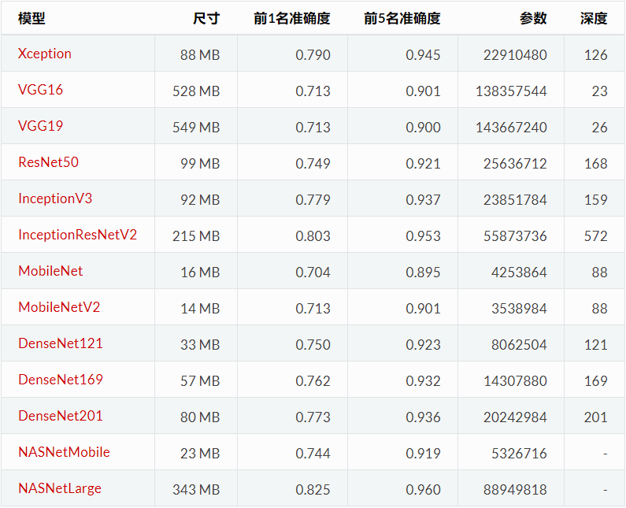

# 深度学习-74: Keras的架构、模型、可视化和案例库

> [深度学习原理与实践(开源图书)-总目录](https://blog.csdn.net/shareviews/article/details/83040730)，建议收藏，告别碎片阅读!

文本介绍Keras的架构，Keras内置数据集，Keras内置模型、内置可视化支持和相关在线资源。Keras一个高度模块化的神经网络库，支持GPU和CPU。Keras支持卷积神经网络和循环神经网络，以及两者的组合。Keras 是一个用 Python 编写的高级神经网络 API，它能够以 TensorFlow, CNTK, 或者 Theano 作为后端运行。Keras 的开发重点是支持快速的实验。能够以最小的时延把你的想法转换为实验结果，是做好研究的关键。

## 1 Keras的架构

Keras(κέρας)在希腊语中意为号角。它来自古希腊和拉丁文学中的一个文学形象，首先出现于《奥德赛》中，梦神(Oneiroi, singular Oneiros)从这两类人中分离出来：那些用虚幻的景象欺骗人类，通过象牙之门(Ivory/ἐλέφας)抵达地球之人，以及那些宣告未来即将到来，通过号角之门(Keras/κέρας)抵达之人。

Keras希望研发人员通过号角(Keras/κέρας)之门抵达真理的彼岸，而不是通过象牙(Ivory/ἐλέφας)之门抵达真理的彼岸。Keras 是一个用 Python 编写的高级神经网络 API，它能够以 TensorFlow, CNTK, 或者 Theano 作为后端运行。Keras 的开发重点是支持快速的实验。能够以最小的时延把你的想法转换为实验结果，是做好研究的关键。

Keras的高级特性:

- 允许简单而快速的原型设计(由于用户友好，高度模块化，可扩展性)。
- 同时支持卷积神经网络和循环神经网络，以及两者的组合。
- 在 CPU 和 GPU 上无缝运行。

## 2 Keras内置数据集

Keras内置波斯顿房价回归数据集、IMDB电影影评情感分类数据集、路透社新闻专线主题分类数据集、手写数字MNIST数据集、时尚MNIST数据库(鞋服裙帽)、CIFAR10小图像数据集和CIFAR100小图像数据集。

### 2.1 波斯顿房价回归数据集

- 数据集取自卡内基梅隆大学维护的StatLib库。

```python
from tensorflow.python import keras
(x_train, y_train), (x_test, y_test) = keras.datasets.boston_housing.load_data()
```

### 2.2 IMDB电影影评情感分类

- 训练集：25000条评论，正面评价标为1，负面评价标为0
- 测试集：25000条评论

```python
from tensorflow.python import keras
(x_train, y_train), (x_test, y_test) = keras.datasets.imdb.load_data(path="imdb.npz",
```

### 2.3 路透社新闻专线主题分类

总数据集：11228条新闻专线，46个主题。

```python
from tensorflow.python import keras
(x_train, y_train), (x_test, y_test) = keras.datasets.reuters.load_data(path="reuters.npz", ....)
```

### 2.4 手写数字MNIST数据集

- 训练集：60000张灰色图像，大小28*28，共10类（0-9）
- 测试集：10000张灰色图像，大小28*28

```python
from tensorflow.python import keras
(x_train, y_train), (x_test, y_test) = keras.datasets.mnist.load_data()
```

### 2.5 时尚MNIST数据库(鞋服裙帽)

- MNIST已经被玩坏了！用时尚MNIST替换吧!
- 训练集：60000张灰色图像，大小28*28，共10类（0-9）
- 测试集：10000张灰色图像，大小28*28

```python
from tensorflow.python import keras
(x_train, y_train), (x_test, y_test) = keras.datasets.mnist.load_data()
```

### 2.6 CIFAR10小图像

- 训练集：50000张彩色图像，大小32*32，被分成10类
- 测试集：10000张彩色图像，大小32*32

```python
from tensorflow.python import keras
(x_train, y_train), (x_test, y_test) = keras.datasets.cifar10.load_data()
```

### 2.7 CIFAR100小图像

- 训练集：50000张彩色图像，大小32*32，被分成100类
- 测试集：10000张彩色图像，大小32*32

```python
from tensorflow.python import keras
(x_train, y_train), (x_test, y_test) = keras.datasets.cifar100.load_data()
```

## 3 Keras内置模型

[TensorFlow Model Zoo](https://github.com/tensorflow/models)

- 官方模型是使用TensorFlow的高级API的示例模型的集合。 它们旨在通过最新的稳定TensorFlow API进行良好维护，测试并保持最新。 它们还应进行合理优化，以便在保持易读性的同时实现快速性能。 我们特别推荐新的TensorFlow用户从这里开始。

- 研究模型是研究人员在TensorFlow中实施的大量模型。 它们没有得到官方支持或在发布分支中可用; 由个体研究人员来维护模型和/或提供问题和拉取请求的支持。

Tensorflow支持Keras的API。Keras提供了预训练的深度学习模型，这些模型可用于预测，特征提取和微调。Keras接口的模型使用方法，请参考文档[Keras Application](https://keras.io/applications/)。

使用[Keras Applications](https://github.com/keras-team/keras-applications)和2012年ILSVRC ImageNet验证集上的TensorFlow后端获得top-k错误，可能与原始版本略有不同。除NASNetLarge（331x331），InceptionV3（299x299），InceptionResNetV2（299x299）和Xception（299x299）外，所有型号的输入大小均为224x224。

使用ImageNet训练的权重进行图像分类的Keras模型：

- Xception
- VGG16
- VGG19
- ResNet50
- InceptionV3
- InceptionResNetV2
- MobileNet
- DenseNet
- NASNet
- MobileNetV2

</br>
数据说明: Top-1和Top-5准确度是指模型在ImageNet验证数据集上的性能。</br>
数据来源：keras-team/keras-applications

## 4 内置可视化支持

keras.utils.vis_utils模块提供了一些绘制Keras模型的实用功能(使用graphviz)。以下实例，将绘制一张模型图，并保存为文件：

```python
keras.utils.plot_model(model, to_file='model.png')
keras.utils.print_summary(model, line_length=None, positions=None, print_fn=None)
```

Keras没有提供更多可视化的支持了。

## 系列文章

- [深度学习原理与实践(开源图书)-总目录](https://blog.csdn.net/shareviews/article/details/83040730)
- [机器学习原理与实践(开源图书)-总目录](https://blog.csdn.net/shareviews/article/details/83030331)
- [Github: 机器学习&深度学习理论与实践(开源图书)](https://github.com/media-tm/MTOpenML)

## 参考文献

- [1] Ian Goodfellow, Yoshua Bengio. [Deep Learning](http://www.deeplearningbook.org/). MIT Press. 2016.
- [2] 焦李成等. 深度学习、优化与识别. 清华大学出版社. 2017.
- [3] 佩德罗·多明戈斯. 终极算法-机器学习和人工智能如何重塑世界. 中信出版社. 2018.
- [Keras中文文档](https://keras.io/zh/)
- [Visualize Convolutional Neural Network](https://tangzhenyu.github.io/deep_learning/2015/03/02/visulize-cnn.html)