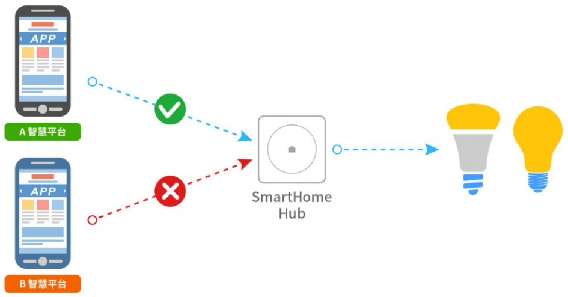
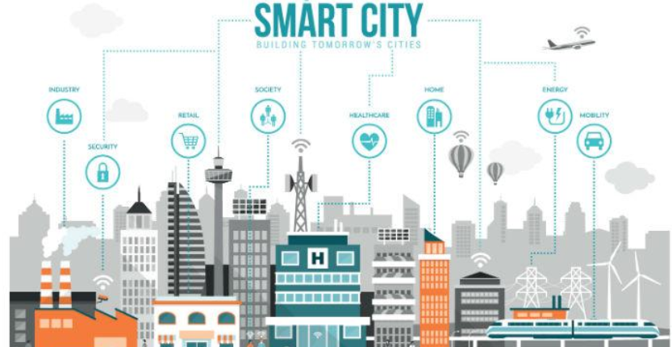
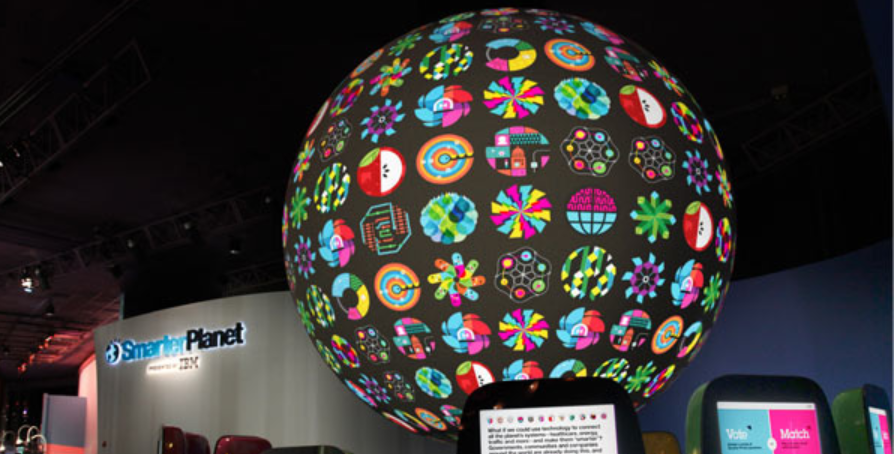

# 深度学习-85:智慧地球/智慧城市/智慧家庭

> [CSDN专栏: 机器学习&深度学习(理论/实践)](https://blog.csdn.net/column/details/27839.html)

网络互联互通在企业级别渗透范围极其广泛，边缘领域(家庭、公共基础设施、安防等)并未网络互联互通，数据都停留在信息孤岛上。智慧地球从很高的维度关注工业化、信息化和全球化的趋势，智慧地球的理念的发布，立即在IT界、经济界、工业界等领域引起了巨大的反响。2009年金融危机，IBM首席执行官彭明盛(SamPalmisano)首次提出智慧地球概念，并并阐明其短期和长期的战略意义，建议奥巴马政府建设下一代智慧型基础设施。奥巴马政府认为智慧地球是挽救危机、振兴经济、确立美国在未来竞争优势的关键所在，并将上升为美国的国家战略。后续投资刺激计划针对智慧地球制定了战略规划和对其进行了大规模投资。2009年2月24日，IBM在中国也提出了“智慧地球赢在中国”，认为智慧地球这一概念可以推动中国向21世纪领先经济转型，中国政府、企业和市民可以相互协作共同创建智能感知的，互联互通的和智能化的生态系统；同时建议优先建设智慧的电力、智慧的医疗、智慧的城市、智慧的交通、智慧的供应链(物流)。智慧地球利用物联网技术、互联网技术和智能化技术，全链条解决数据采集、传输和处理过程。智慧地球如果广泛部署，新一代的IT、互联网技术充分运用到各行各业，把感应器嵌入、装备到全球的医院、电网、铁路、桥梁、隧道、公路、建筑、供水系统、大坝、油气管道，通过互联网形成“物联网”；而后通过超级计算机和云计算，使得人类以更加精细、动态的方式和生活。

## 1 智慧的内涵

### 1.1 智慧地球的三个重要维度

- 智慧地球具有智能感知能力，实时感知经济、社会活动的相关信息。
- 智慧地球具有全面地互联互通，统一互联网和物联网
- 智慧地球具有智能分析能力，使用先进技术来进行复杂的数据分析、汇总和计算，整合和分析海量的跨地域、跨行业和职能部门的信息，并将特定的知识应用到特定行业、特定的场景、特定的解决方案中以更好地支持决策和行动。

### 1.2 智慧地球需要关注的四个关键问题

- 新锐洞察：面对无数个信息孤岛式的爆炸性数据增长，需要获得新锐的智能和洞察，利用众多来源提供的丰富实时信息，以做出更明智的决策；
- 智能运作：需要开发和设计新的业务和流程需求，实现在灵活和动态流程支持下的聪明的运营和运作，达到全新的生活和工作方式；
- 动态架构：需要建立一种可以降低成本、具有智能化和安全特性、并能够与当前的业务环境同样灵活动态的基础设施；
- 绿色未来：需要采取行动解决能源、环境和可持续发展的问题，提高效率、提升竞争力。

### 1.3 智慧地球的技术

只有各行各业的系统都演变成智慧系统，智慧地球才能真正实现。实现智慧地球赖于以下3个条件：

- 高科技的普遍应用；
- 广泛意义的物联网切入到人们生产生活的各个方面；
- 云计算、传感器网络以及数据挖掘等让人类最大化地利用信息资源，并从中获得前所未有的洞察力，更快、更好地作出决策。

要满足以上3个条件，智慧地球需要无线射频识别技术、传感器网络技术、高速分组接入技术、云计算技术、软件服务化技术、数据挖掘技术、高性能计算技术等支撑。确切的说，智慧地球涵盖了当前所有先进信息技术在各个层次的部署和应用。

### 1.4 智慧地球的愿景

智慧地球利用互联网和物联网，让各行各业接入统一的系统，最终形成一个互联互通和智能化的生态系统。IBM的理念高屋建瓴，切合企业和政府的核心诉求，提供针对金融、电信、能源、制造业、交通、医疗、城市、社会信息化等领域的先进解决方案。IBM通过概念整合和产业链整合，成功忽悠奥巴马政府实施智慧地球战略。

IBM提出智慧地球的概念是经过精心谋划、充分准备和周密部署的。IBM确信没有竞争对手可以在智慧地球的技术实现领域超越它。实现智慧地球愿景的关键技术：传感器网络、云计算、超级计算、软件服务化、数据整合与挖掘等等都是IBM的技术优势，IBM已经构筑了1个没有竞争对手的信息技术生态环境。从宏观战略目标分析，IBM希望借助智慧地球再一次引领世界IT产业发展，占领竞争的制高点。智慧地球作为迄今为止最大规模的物联网络概括了这个时代所有的IT技术。智慧地球的实施一方面可以带动下一代信息技术的发展，一方面也有带来新的技术壁垒形成的可能。

## 2 智慧家族

利用IT基础设施优化我们生活和工作场景，构成了智慧硬件和软件解决方案家族。智慧家族按照规模分为：智慧家庭、智慧企业、智慧园区、智慧城市、智慧国家和智慧地球。

### 2.1 智慧家庭

智慧家庭是智慧城市的最小单元，是以家庭为载体，以家庭成员之间的亲情为纽带，结合物联网、云计算、移动互联网和大数据等新一代信息技术，实现低碳、健康、智能、舒适、安全和充满关爱的家庭生活方式。智慧家庭又可称为智慧家庭服务平台，是综合运用物联网、云计算、移动互联网和大数据技术，结合自动控制技术，将家庭设备智能控制、家庭环境感知、家人健康感知、家居安全感知以及信息交流、消费服务等家居生活有效地结合起来，创造出健康、安全、舒适、低碳、便捷的个性化家居生活。

 
图-X: 智慧家庭-智能硬件

### 2.2 智慧企业

从信息化发展角度看，以物联网、大数据和人工智能为代表的信息技术发展，已使智慧企业建设具备信息基础和产业基础；同时，不断提升的工业设备智能化水平，也为智慧企业建设创造了良好的技术支撑，但纵观诸多企业的信息化或智能化建设，均存在不系统、不全面、不统一，没有从根本上解决信息孤岛、数据碎片等问题。因此，深入推进智慧企业实践必须正确处理好信息技术、工业技术和管理技术的三者理论关系，采用技术创新和管理创新的两轮驱动模式，实现三者的完美融合，保障各业务数据量化和集成集中共享，统一决策平台和管理智能协同。

《智慧企业——框架与实践》创新，将先进的信息技术、工业技术和管理技术深度融合，实现管理的数字化感知、网络化传输、大数据处理和智能化应用，从而使企业呈现出风险识别自动化、决策管理智能化、纠偏升级自主化的柔性组织形态和新型管理模式。

### 2.3 智慧园区

智慧园区的建设目标如下：

- 通过智慧园区的建设，帮助园区在信息化方面建立统一的组织管理协调架构、业务管理平台和对内对外服务运营平台。
- 建立统一的工作流程，协同、调度和共享机制，通过云平台的整合，以云平台为枢纽，形成一个紧密联系的整体，获得高效、协同、互动、整体的效益。
- 建立统一的应急管理与日常管理、对内与对外服务这2大服务和2大管理体系。

产业园区一般具有占地面积大、公共区域多、人员密集、组织复杂等特点，给园区运营管理带来极大挑战：

- 安全保障困难：由于园区管理体量大，对于非法人员、车辆进入，发生盗窃、破坏等行为，单靠保安人眼检测数量巨大的摄像头，很难在第一时间发现警情；
- 能源浪费严重：水、电、气等能源设备分步广，由于缺乏智能的能耗数据采集、分析功能，无法进行有效的监管和调节；
- 园区管理落后：缺乏专业的园区规划，信息化水平低，IT资源分散，无统一的管理门户，造成园区管理难度大，无法为园区企业提供新型的服务。

华为智慧园区解决方案基于云计算、物联网等先进技术，搭建园区管理支撑和应用服务支撑两大平台，重点开发数字安防、智能物管和智能办公三大应用包，为园区管理者及入驻企业提供便利，增强园区的综合竞争力和辐射带动力。

- 数字安防：覆盖园区的视频监控系统与入侵报警联动，发生非法闯入时，系统自动将报警信号和视频发送到移动客户端或指挥中心，监控台确认后按事先设定的规则进行声光报警，或启动应急预案，使事件得到及时处理，园区安防等级得到提升，企业的资产和人员的安全更有保障。
- 人员管理：基于一卡通实现一站式人员管理，“一张卡”代替员工身份证、工卡、钱包、钥匙，亦能对访客进行全面智能化管理，包括车辆管理、门禁控制、路线指引、物品存放、就餐购物等，为园区业主和访客提供良好的服务体验。
- 车辆管理：免刷卡自动出入，提高通行效率和安全；精确车位引导系统，实现停车场的高效管理；违法停车管理有效解决园区乱停乱放现象；车辆行驶引导及轨迹跟踪，保障企业物资安全。
- 绿色节能管理：通过绿色机房和云计算/云桌面技术，提高资源利用率，降低IT能耗及GHG排放；基于AMI（高级计量系统），依托数据网络实现对园区内重点区域、重点设备的能耗监测、能效管理，实现绿色节能。
- 综合管理：对各个业务子系统有效集成衔接，提供统一用户接入门户，给园区管理者和企业员工提供直观、简洁、方便的管理操作。
- 智能办公：园区为入驻企业提供办公套餐业务，包括桌面云、统一通信、呼叫中心、融合会议及信息驿站，使企业摆脱信息化建设的负担，实现拎包入驻。

智慧园区建设通过现代园区管理理念和优质的客户服务，将为园区物业和企业带来巨大的经济效益，同时树立品牌效应，吸引更多企业入驻，推动新型战略产业的聚集，带动地区经济发展。

### 4 智慧城市

新时代、新环境、新机遇、新挑战。这个新时代，是创新2.0的时代。互联网的深入发展催生了面向创新2.0的新网络、新数据环境，营造了将人们生活、工作、交往的社会空间作为城域开放众创空间的创新2.0新生态，推动了创新2.0时代的群众路线新实践，正在重写新时代创新驱动新型智慧城市的建造意义，为推进中国特色时代特点的智慧城市发展提供新的机遇。

学森强调通过专家体系、技术体系、数据体系三大体系的综合集成，达到集大成，成智慧。推进创新2.0时代的新型智慧城市建设，必须回到大成智慧学的研究与发展。大数据充分体现了人机结合、人网结合、以人为主的新网络、新数据环境，营造了将人们生活工作的城市空间作为开放众创空间的创新2.0新生态，开放数据及维基政府实践充分体现了钱学森所强调的大成智慧，进一步催生创新的涌现。

创新2.0时代的智慧城市不仅强调新一代信息技术的应用，更强调通过人的联网、物的联网、数据的联网、思想的联网实现以人为本的可持续创新，强调依托城域开放众创空间营造构建智慧社会，推进创新2.0时代新型智慧城市建设的新路径。

伴随网络帝国的崛起、移动技术的融合发展以及创新的民主化进程，知识社会环境下的智慧城市是继数字城市之后信息化城市发展的高级形态。智慧城市是新一代信息技术支撑、知识社会创新2.0环境下的城市形态，通过新一代信息技术支撑实现全面透彻感知、宽带泛在互联、智能融合应用，推动以用户创新、开放创新、大众创新、协同创新为特征的以人为本的可持续创新。从技术发展的视角，智慧城市建设要求通过以移动技术为代表的物联网、云计算等新一代信息技术应用实现全面感知、泛在互联、普适计算与融合应用。从社会发展的视角，智慧城市还要求通过维基、社交网络、Fab Lab、Living Lab、综合集成法等工具和方法的应用，营造有利于创新涌现的制度环境与生态，实现以用户创新、开放创新、大众创新、协同创新为特征的知识社会环境下的可持续创新，强调通过价值创造，以人为本实现经济、社会、环境的全面可持续发展。

智慧城市的经济是循环经济。循环经济是一种以资源的高效利用和循环利用为核心，要求以“3R”为经济活动的行为准则(3R即减量化reduce、再使用reuse、再循环recyle)，以低消耗、低排放、高效率为基本特征，符合可持续发展理念的经济增长模式，是对“大量生产、大量消费、大量废弃”的传统增长模式的根本变革。智慧城市的循环经济即是充分考虑城市生态系统的承载能力，尽可能节约城市资源，不断提高现有资源的利用效率，循环使用资源，创造良性的社会财富。

 
图-X: 智慧城市的概念

### 5 智慧地球

智慧地球从很高的维度关注工业化、信息化和全球化的趋势，智慧地球的理念的发布，立即在IT界、经济界、工业界等领域引起了巨大的反响。2009年金融危机，IBM首席执行官彭明盛(SamPalmisano)首次提出智慧地球概念，并并阐明其短期和长期的战略意义，建议奥巴马政府建设下一代智慧型基础设施。

 
图-X: IBM的智慧地球战略

## 系列文章

- [CSDN专栏: 机器学习理论与实践(开源图书)](https://blog.csdn.net/column/details/27839.html)
- [CSDN专栏: 深度学习理论与实践(开源图书)](https://blog.csdn.net/column/details/27839.html)
- [Github: 机器学习&深度学习理论与实践(开源图书)](https://github.com/media-tm/MTOpenML)

## 参考文献

- [1] Ian Goodfellow, Yoshua Bengio. [Deep Learning](http://www.deeplearningbook.org/). MIT Press. 2016.
- [2] 焦李成等. 深度学习、优化与识别. 清华大学出版社. 2017.
- [3] 佩德罗·多明戈斯. 终极算法-机器学习和人工智能如何重塑世界. 中信出版社. 2018.
- [4] 雷.库兹韦尔. 人工智能的未来-揭示人类思维的奥秘.  浙江人民出版社. 2016.