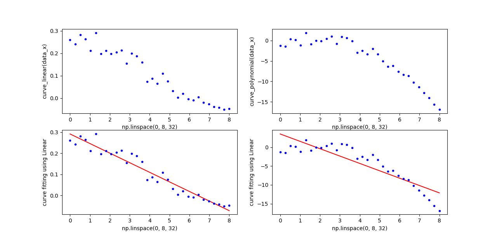

# 线性回归(Linear Regression)算法

> 一起创作,Come on!!! [简练而全面的开源ML&AI电子书](https://github.com/media-tm/MTOpenML)

线性回归(Linear Regression)算法属于有监督的回归(Regression)学习算法。回归(Regression)算法通过建立变量之间的回归模型，通过学习(训练)过程得到变量与因变量之间的相关关系。回归(Regression)分析可以用于预测模型或分类模型。常见的回归算法包括：线性回归(Linear Regression)、非线性回归(Non-linear Regression)、逻辑回归(Logistic Regression)、多项式回归(Polynomial Regression)、岭回归(Ridge Regression)、套索回归(Lasso Regression)和弹性网络回归(ElasticNet Regression)。其中线性回归、非线性回归和逻辑回归最为常用。

线性回归(Linear Regression)算法就是寻找一条最优的直线来拟合数据(可以扩展到多维)。线性回归通常采用给定的函数值与模型预测值之差的平方和最小为损失函数, 并使用最小二乘法和梯度下降法来计算最终的拟合参数。

## 1 算法原理

线性回归的主要思想就是通过历史数据拟合出一条直线，用这条直线对新的数据进行预测。线性回归的公式如下：  
$h_θ(x)=θ_0+θ_1x_1+θ_2x_2+θ_3x_3...+θ_nx_n=θ^Tx$

从上式可以得出：要想获得一个与目标数据集完美拟合的线性模型，实质就是求解出每个特征自变量的权值θ。线性回归首先构建一个凸函数的优化函数(诸如: 给定的函数值与模型预测值之差的平方和最小)，并使用最小二乘法和梯度下降法来计算最终的拟合参数。

逻辑回归(Logistic Regression)分类算法的核心步骤如下:

- 构造 predict 函数，采用n维线性函数;
- 构造 loss 函数, 给定的函数值与模型预测值之差的平方和最小;
- 使用最小二乘法和梯度下降法计算最终的拟合参数;
- 反复迭代优化最终的拟合参数;
- 输出最终的拟合参数

逻辑回归(Logistic Regression)分类算法的核心优势如下：

- 计算伸缩性: 计算复杂度可控;
- 参数依赖性: 可调节参数较少;
- 普适性能力: 适用于连续型和离散型数据集；
- 抗噪音能力: 对缺失数据和异常数据比较敏感，需要特别关注;
- 结果解释性: 理论简练，解释性好。

## 2 算法实例

- 参见 [7.2 SkLearn的回归算法](../7-ml-sklearn/72-sklearn-regression.md)
- 参见 [8.2 Tensorflow的回归算法](../7-ml-tensorflow/82-tensorflow-regression.md)

构造线性函数： $h(x)=0.3-0.05*x$,并在线性函数上添加随机值；构造多项式函数 $h(x)=0.1-0.02*x+0.03*x^2-0.04*x^3$，并在多项式函数上添加随机值；使用SkLearn的LinearRegression模块拟合曲线。效果如下图。

可以使用sklearn.metrics.mean_squared_error 评估误差。从结果可见，使用线性函数去拟合多项式函数效果很差。

- 对于线性数据集，线性拟合函数的MSE为0.00069
- 多余多项式数据集，线性拟合函数的MSE为6.40752

## 3 典型应用

线性回归在定量和定性的数据中有广泛的用途。例如：图像&视频质量评价研究中，研究人员提出一个新的客观质量图像&视频质量评价指标，在横向对比分析中，研究人员需要将其评价指标其它类型的指标(PNSR, SSIM, CMOS等)做线性回归，以期望度量指标的最终价值。

## 参考资料

- [1] 周志华. 机器学习. 清华大学出版社. 2016.
- [2] [日]杉山将. 图解机器学习. 人民邮电出版社. 2015.
- [3] 佩德罗·多明戈斯. 终极算法-机器学习和人工智能如何重塑世界. 中信出版社. 2018.
- [4] 李航. 统计学习方法. 2012.