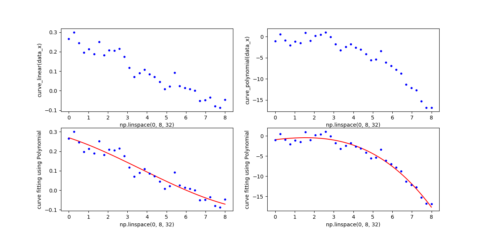

# 机器学习-43:多项式回归算法(Polynomial Regression)

> [CSDN专栏: 机器学习理论与实践](https://blog.csdn.net/column/details/27839.html)

多项式回归(Polynomial Regression)算法属于有监督的回归(Regression)学习算法。回归(Regression)算法通过建立变量之间的回归模型，通过学习(训练)过程得到变量与因变量之间的相关关系。回归(Regression)分析可以用于预测模型或分类模型。常见的回归算法包括：线性回归(Linear Regression)、非线性回归(Non-linear Regression)、逻辑回归(Logistic Regression)、多项式回归(Polynomial Regression)、岭回归(Ridge Regression)、套索回归(Lasso Regression)和弹性网络回归(ElasticNet Regression)。其中线性回归、非线性回归和逻辑回归最为常用。

很多场合线性模型无法很好的拟合目标数据曲线，这就需要引入非线性回归模型。对于非线性回归存在多种策略，第一种策略是将非线性回归转化成线性回归；第二种策略是将非线性回归转化成多项式回归。多项式回归中，加入了特征的更高次方(例如平方项或立方项)，也相当于增加了模型的自由度，用来捕获数据中非线性的变化。

## 1 算法原理

多项式回归的主要思想就是通过历史数据拟合出多项式回归的方程，并利用多项式回归的方程对新的数据进行预测。多项式回归的方程如下:

$h_θ(x)=θ_0x^0+θ_1x^1+θ_2x^2+θ_3x^3...+θ_nx^n= X⋅θ$

从上式可以得出：要想获得一个与目标数据集完美拟合的多项式回归模型，实质就是求解出每个特征自变量的权值θ。线性回归首先构建一个凸函数的优化函数(诸如: 给定的函数值与模型预测值之差的平方和最小)，并使用最小二乘法和梯度下降法来计算最终的拟合参数。

逻辑回归(Logistic Regression)分类算法的核心步骤如下:

- 构造 predict 函数, 采用多项式回归的方程;
- 构造 loss 函数, 给定的函数值与模型预测值之差的平方和最小;
- 使用最小二乘法和梯度下降法计算最终的拟合参数;
- 反复迭代优化最终的拟合参数;
- 输出最终的拟合参数

逻辑回归(Logistic Regression)分类算法的核心优势如下：

- 计算伸缩性: 计算复杂度可控;
- 参数依赖性: 可调节参数较少;
- 普适性能力: 适用于连续型和离散型数据集, 关注过拟合问题;
- 抗噪音能力: 对缺失数据和异常数据比较敏感, 需要特别关注;
- 结果解释性: 理论简练, 解释性好。

## 2 算法实例

- 参见 [7.2 SkLearn的回归算法](../7-ml-sklearn/72-sklearn-regression.md)
- 参见 [8.2 Tensorflow的回归算法](../7-ml-tensorflow/82-tensorflow-regression.md)

构造线性函数： $h(x)=0.3-0.05*x$,并在线性函数上添加随机值；构造多项式函数 $h(x)=0.1-0.02*x+0.03*x^2-0.04*x^3$，并在多项式函数上添加随机值；使用SkLearn的LinearRegression模块拟合曲线。效果如下图。

可以使用sklearn.metrics.mean_squared_error 评估误差。从结果可见，多项式函数可以拟合线性函数，但是出现过拟合现象。多项式函数拟合多项式函数最佳，但是也需要多项式的阶数，用高阶多项式函数拟合低阶多项式函数也会出现过拟合现象。

- 对于线性数据集，多项式拟合函数的MSE为0.00055
- 多余多项式数据集，多项式拟合函数的MSE为0.61483

## 3 典型应用

线性回归在定量和定性的数据中有广泛的用途。例如：图像&视频质量评价研究中，研究人员提出一个新的客观质量图像&视频质量评价指标，在横向对比分析中，研究人员需要将其评价指标其它类型的指标(PNSR, SSIM, CMOS等)做线性回归，以期望度量指标的最终价值。

## 系列文章

- [Gihutb专栏: 机器学习&深度学习(理论/实践)](https://github.com/media-tm/MTOpenML)
- [CSDN专栏: 机器学习理论与实践](https://blog.csdn.net/column/details/27839.html)
- [CSDN专栏: 深度学习理论与实践](https://blog.csdn.net/column/details/27839.html)

## 参考资料

- [1] 周志华. 机器学习. 清华大学出版社. 2016.
- [2] [日]杉山将. 图解机器学习. 人民邮电出版社. 2015.
- [3] 佩德罗·多明戈斯. 终极算法-机器学习和人工智能如何重塑世界. 中信出版社. 2018.
- [4] 李航. 统计学习方法. 2012.