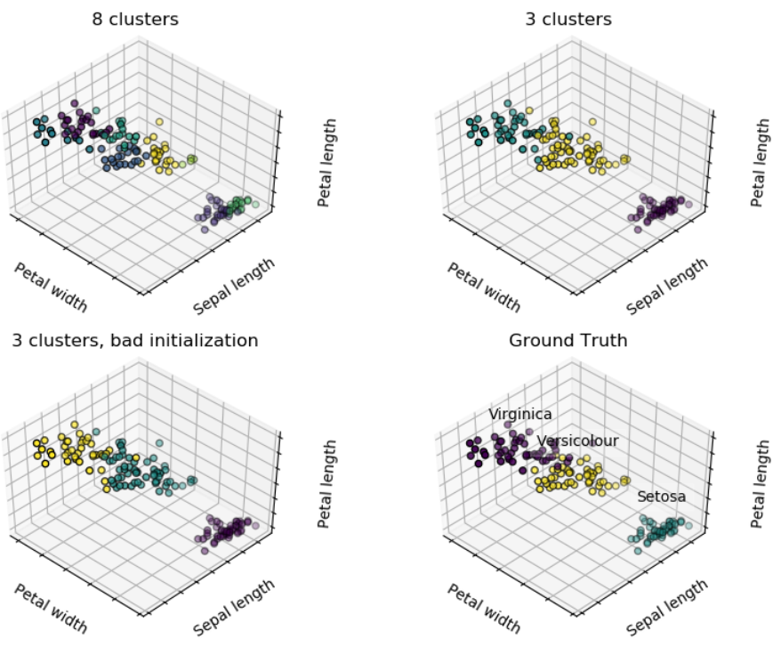

# 机器学习-61:K均值聚类算法(K-Means Clustering)

> [机器学习原理与实践(开源图书)-总目录](https://blog.csdn.net/shareviews/article/details/83030331)

机器学习分为监督学习、无监督学习和半监督学习(强化学习)。无监督学习最常应用的场景是聚类(clustering)和降维(dimension reduction)。聚类算法包括：K均值聚类(K-Means)、层次聚类(Hierarchical Clustering)和混合高斯模型(Gaussian Mixture Model)。降维算法包括：主成因分析(Principal Component Analysis)和线性判别分析(Linear Discriminant Analysis)。

> 告别碎片阅读，构成知识谱系。一起阅读和完善: [机器学习原理与实践(开源图书)](https://github.com/media-tm/MTOpenML)

K均值聚类(K-Means)算法的核心思想是：对于给定的样本集，按照样本之间的距离大小，将样本集划分为K个簇。让簇内的点尽量紧密的连在一起，而让簇间的距离尽量的大。

## 1 算法原理

K均值聚类(K-Means)算法的核心步骤如下:

- 将数据集{D}中随机取K个元素，作为K个簇的各自的中心。最佳实践：根据经验或交叉验证方式选择合适的K值。
- 分别计算剩下的元素到K个簇中心的相异度，将这些元素分别划归到相异度最低的簇。
- 根据聚类结果，重新计算K个簇各自的中心，计算方法是取簇中所有元素各自维度的算术平均数。
- 将{D}中全部元素按照新的中心重新聚类。
- 重复第 4 步，直到每个簇的中心基本不再变化。
- 将结果输出。

K均值聚类(K-Means)算法的核心优势如下：

- 计算伸缩性: 算法复杂度不高，算法收敛速度快，聚类效果好;
- 参数依赖性: 可控制的参数较少(仅簇数k), 调参简单;
- 普适性能力: 泛化能力一般，容易受到噪音干扰;
- 抗噪音能力: 需要考虑局部最优问题，异常数据干扰问题等;
- 结果解释性: 模型和结果均具有解释性。

## 2 算法实例

sklearn.cluster.KMeans(n_clusters=8, init=’k-means++’, n_init=10, max_iter=300, tol=0.0001, precompute_distances=’auto’, verbose=0, random_state=None, copy_x=True, n_jobs=None, algorithm=’auto’)

- n_clusters：数据集将被划分成多少个簇，最佳实践：多次选取并评估质量。
- max_iter : 最大迭代次数(default: 300)

请参考下面两个Sklearn官方示例

- [K-means Clustering](http://scikit-learn.org/stable/auto_examples/cluster/plot_cluster_iris.html)
- [Comparing different clustering algorithms on toy datasets](http://scikit-learn.org/stable/auto_examples/cluster/plot_cluster_comparison.html)

图-1：K均值聚类(K-Means)示例,数据来源[scikit-learn](http://scikit-learn.org)

## 3 典型应用

- 用户画像: 在电子商务、新闻客户端、视频客户端通过对用户行为数据的聚类分析，可以准确刻画用户画像。精准的用户画像，对于优化内容推送，内容搜索，广告分发具有重大意义。
- 地理信息: 对于地域性比较强的领域，诸如：汽车保险、个人意外险、房屋租赁和二手房交易等。从用户数据中聚类出此类信息，能够在上述领域充分匹配用户和产品，实现精准营销。

## 系列文章

- [深度学习原理与实践(开源图书)-总目录](https://blog.csdn.net/shareviews/article/details/83040730)
- [机器学习原理与实践(开源图书)-总目录](https://blog.csdn.net/shareviews/article/details/83030331)
- [Github: 机器学习&深度学习理论与实践(开源图书)](https://github.com/media-tm/MTOpenML)

## 参考资料

- [1] 周志华. 机器学习. 清华大学出版社. 2016.
- [2] [日]杉山将. 图解机器学习. 人民邮电出版社. 2015.
- [3] 佩德罗·多明戈斯. 终极算法-机器学习和人工智能如何重塑世界. 中信出版社. 2018.
- [4] [深入理解K-Means聚类算法](https://blog.csdn.net/taoyanqi8932/article/details/53727841)
- [5] [K-means Algorithm](http://www.cnblogs.com/jeromeblog/p/3425919.html)