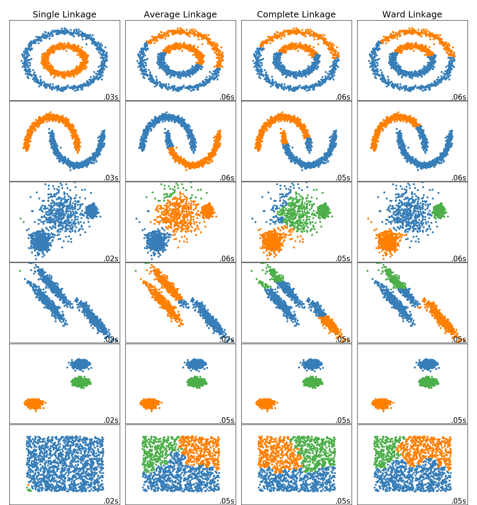

# 机器学习-62:层次聚类算法(Hierarchical Clustering)

> [机器学习原理与实践(开源图书)-总目录](https://blog.csdn.net/shareviews/article/details/83030331)

机器学习分为监督学习、无监督学习和半监督学习(强化学习)。无监督学习最常应用的场景是聚类(clustering)和降维(dimension reduction)。聚类算法包括：K均值聚类(K-Means)、层次聚类(Hierarchical Clustering)和混合高斯模型(Gaussian Mixture Model)。降维算法包括：主成因分析(Principal Component Analysis)和线性判别分析(Linear Discriminant Analysis)。

> 告别碎片阅读，构成知识谱系。一起阅读和完善: [机器学习原理与实践(开源图书)](https://github.com/media-tm/MTOpenML)

层次聚类(Hierarchical Clustering)是一种聚类算法，属于无监督学习。层次聚类通过计算不同类别数据点间的相似度来创建一棵有层次的嵌套聚类树。在聚类树中，不同类别的原始数据点是树的叶节点，树的顶层是一个聚类的根节点。创建聚类树的经典方式是：自下而上合并方法和自上而下分裂方法。

## 1 算法原理

层次聚类方法的基本思想是：对给定的数据集进行层次化分解，根据一定的连接规则(单连接、全连接、平均连接和欧式几何距离等)反复迭代将数据以层次架构将二个小类别聚合为一个大类别。

通过某种相似性测度计算节点之间的相似性，并按相似度由高到低排序，逐步重新连接节点。该方法的优点是可随时停止划分，主要步骤如下：

- 将每个数据样本看做一个类，计算样本两两之间的最小距离;
- 将距离最小的两个小类别合并成一个新类别;
- 重新计算新类和所有类之间的距离;
- 反复迭代(2)(3)步骤，直到所有的类合并成一个大类别。

聚类过程中，小类合并为大类或者大类分裂为小类，判断两个类别之间的相似度常见有三种方法：

- 单连接(Single Linkage): 取两个类中距离最近的两个样本的距离作为这两个集合的距离, 两个样本之间的距离越小，这两个类之间的相似度就越大。
- 全连接(Complete Linkage): 取两个集合中距离最远的两个点的距离作为两个集合的距离, 两个Cluster之间的距离比较接近，但是由于个别点的原因，两个Cluster无法合并。
- 平均连接(Average Linkage): 把两个集合中的点两两的距离全部放在一起求一个平均值，以平均值衡量这两个聚类的相似值相对合理。

层次聚类(Hierarchical Clustering)算法的核心优势如下：

- 计算伸缩性: 距离和规则可自由选择，计算量大;
- 参数依赖性: 不需要预设参数，自动发现层次关系;
- 普适性能力: 自动发现层次关系，结果受奇异值干扰;
- 抗噪音能力: 结果受奇异值干扰;
- 结果解释性: 模型和结果均具有解释性。

## 2 算法实例

sklearn.cluster.AgglomerativeClustering: 使用自底向上的聚类方法，主要有三种聚类准则：

- complete(maximum) linkage: 两类间的距离用最远点距离表示。
- avarage linkage:平均距离。
- ward's method: 以组内平方和最小，组间平方和最大为目的。

请参考下面两个Sklearn官方示例

- [Comparing different hierarchical linkage methods on toy datasets](http://scikit-learn.org/stable/auto_examples/cluster/plot_linkage_comparison.html)
- [Comparing different clustering algorithms on toy datasets](http://scikit-learn.org/stable/auto_examples/cluster/plot_cluster_comparison.html)

图-1：高斯混合模型(GaussianMixture)示例,数据来源[scikit-learn](http://scikit-learn.org)

## 3 典型应用

在企业架构、社会组织架构和政府组织架构中，具有非常明显的层次性，分层次是一种先进的思维，推动着组织能力向专业化分工，整体上提高了组织的能力。可以用一个树状网络描述类似的组织架构，一般通过给定网络的拓扑结构定义网络节点间的相似性或距离，然后采用单连接层次聚类或全连接层次聚类将网络节点组成一个树状图层次结构。树的叶节点表示网络节点，由相似或距离接近的子节点合并而得到父节点。

## 系列文章

- [深度学习原理与实践(开源图书)-总目录](https://blog.csdn.net/shareviews/article/details/83040730)
- [机器学习原理与实践(开源图书)-总目录](https://blog.csdn.net/shareviews/article/details/83030331)
- [Github: 机器学习&深度学习理论与实践(开源图书)](https://github.com/media-tm/MTOpenML)

## 参考文献

- [1] 周志华. 机器学习. 清华大学出版社. 2016.
- [2] [日]杉山将. 图解机器学习. 人民邮电出版社. 2015.
- [3] 佩德罗·多明戈斯. 终极算法-机器学习和人工智能如何重塑世界. 中信出版社. 2018.