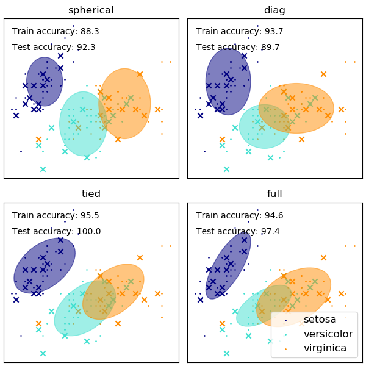

# 机器学习-63:混合高斯模型(Gaussian Mixture Model)聚类算法

> [CSDN专栏: 机器学习理论与实践](https://blog.csdn.net/column/details/27839.html)

机器学习分为监督学习、无监督学习和半监督学习(强化学习)。无监督学习最常应用的场景是聚类(clustering)和降维(dimension reduction)。聚类算法包括：K均值聚类(K-Means)、层次聚类(Hierarchical Clustering)和混合高斯模型(Gaussian Mixture Model)。降维算法包括：主成因分析(Principal Component Analysis)和线性判别分析(Linear Discriminant Analysis)。

高斯混合模型(Gaussian Mixture Model)简称GMM, 高斯混合模型使用K个高斯分布的结合组成的概率分布模型，并使用了期望最大(Expectation Maximization，简称EM)算法进行训练。其理论基础是：K个高斯分布的结合组成的概率分布模型理论上可以任意地逼近任何连续的概率密分布。

高斯分布(Gaussian distribution)也被称为正态分布(normal distribution)，是一种在自然界大量的存在的、最为常见的分布形式。

## 1 算法原理

混合高斯模型(Gaussian Mixture Model)聚类算法的核心步骤如下:

- 通过观察采样的概率值和模型概率值的接近程度，来判断一个模型是否拟合良好;
- 通过模型来计算数据的期望值，通过更新分布的均值和标准差(参数μ和σ)来让期望值最大化;
- 反复迭代这个过程很多次，直到两个概率值非常接近时;
- 停止更新并完成模型训练。

混合高斯模型(Gaussian Mixture Model)聚类算法的核心优势如下：

- 计算伸缩性: 使用多个高斯分布的组合来刻画数据分布, 计算伸缩性好;
- 参数依赖性: 可调整参数为分布的均值和标准差(参数μ和σ);
- 普适性能力: 描述能力和泛化能力优于K均值聚类(K-Means);
- 抗噪音能力: 由于K均值聚类(K-Means);
- 结果解释性: 模型和结果均具有解释性。

## 2 算法实例

 高斯混合模型是概率模型，其假设所有数据点是从具有未知参数的有限数量的高斯分布的混合生成的。 高斯混合模型可以视为
 k均值聚类，协方差结构和样本中心的混合体。 GaussianMixture用于拟合高斯模型混合的期望最大化(EM)模型，并计算出置信椭圆体，准确率和聚类数量等关键参数。GaussianMixture有不同的选项来约束估计的差分类的协方差：球形，对角线，并列或完全协方差。

 Sklearn高斯混合模型(GaussianMixture)示例代码请参考[GMM covariances](http://scikit-learn.org/stable/auto_examples/mixture/plot_gmm_covariances.html)

 

## 3 典型应用

- 用户画像: 在电子商务、新闻客户端、视频客户端通过对用户行为数据的聚类分析，可以准确刻画用户画像。精准的用户画像，对于优化内容推送，内容搜索，广告分发具有重大意义。
- 地理信息: 对于地域性比较强的领域，诸如：汽车保险、个人意外险、房屋租赁和二手房交易等。从用户数据中聚类出此类信息，能够在上述领域充分匹配用户和产品，实现精准营销。

## 系列文章

- [Gihutb专栏: 机器学习&深度学习(理论/实践)](https://github.com/media-tm/MTOpenML)
- [CSDN专栏: 机器学习理论与实践](https://blog.csdn.net/column/details/27839.html)
- [CSDN专栏: 深度学习理论与实践](https://blog.csdn.net/column/details/27839.html)

## 参考资料

- [1] 周志华. 机器学习. 清华大学出版社. 2016.
- [2] [日]杉山将. 图解机器学习. 人民邮电出版社. 2015.
- [3] 佩德罗·多明戈斯. 终极算法-机器学习和人工智能如何重塑世界. 中信出版社. 2018.