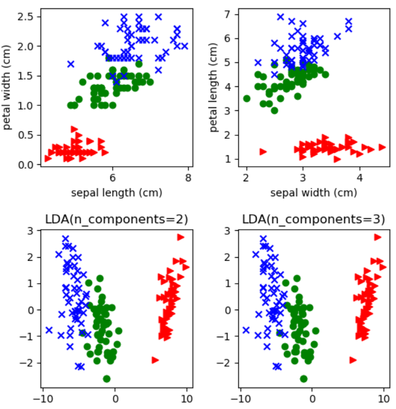

# 线性判别分析(Linear Discriminant Analysis)降维算法

> 一起创作,Come on!!! [简练而全面的开源ML&AI电子书](https://github.com/media-tm/MTOpenML)

机器学习分为监督学习、无监督学习和半监督学习(强化学习)。无监督学习最常应用的场景是聚类(clustering)和降维(dimension reduction)。聚类算法包括：K均值聚类(K-Means)、层次聚类(Hierarchical Clustering)和混合高斯模型(Gaussian Mixture Model)。降维算法包括：主成因分析(Principal Component Analysis)和线性判别分析(Linear Discriminant Analysis)。

线性判别分析(Linear Discriminant Analysis-LDA)是一种监督学习的降维技术, 即他要求训练数据是有标签信息的数据集。主成因分析(Principal Component Analysis-PCA)是一种无监督学习的降维技术。

线性判别分析(Linear Discriminant Analysis-LDA)的核心思想是：投影后类内方差最小，类间方差最大。LDA要将数据在低维度上进行投影，投影后希望每一种类别数据的投影点尽可能的接近，而不同类别的数据的类别中心之间的距离尽可能的大。

## 1 算法原理

线性判别分析(Linear Discriminant Analysis-LDA)基本思想是假设各个类别的样本数据符合高斯分布，这样利用LDA进行投影后，可以利用极大似然估计计算各个类别投影数据的均值和方差，进而得到该类别高斯分布的概率密度函数。当一个新的样本到来后，我们可以将它投影，然后将投影后的样本特征分别带入各个类别的高斯分布概率密度函数，计算它属于这个类别的概率，最大的概率对应的类别即为预测类别。

线性判别分析(Linear Discriminant Analysis-LDA)降维算法的核心步骤如下:

- 计算类内散度矩阵: $S_w$;
- 计算类间散度矩阵: $S_b$;
- 计算矩阵: $S_w^{-1}S_b$;
- 计算$S_w^{-1}S_b$矩阵的最大的d个特征值和对应的d个特征向量(w1,w2,...wd),得到投影矩阵
- 取出原始高维度样本x(i), 进行降维计算操作，获得低维度样本: $z(i)=W^Tx(i)$;
- 输出降维后的样本集 $D′=(z(1),z(2),...,z(m))$。

线性判别分析(Linear Discriminant Analysis-LDA)降维算法的核心优势如下：

- 计算伸缩性: LDA算法可以使用类别的先验知识，PCA无需先验知识;
- 参数依赖性: 样本分类信息依赖均值而不是方差的时候，比PCA之类的算法较优;
- 普适性能力: LDA不适合对非高斯分布样本进行降维，PCA也有这个问题;
- 抗噪音能力: 抗噪音能力一般;
- 结果解释性: 特征维度的含义可能具有模糊性，解释性降低。

## 2 算法实例

注意：本文中使用sklearn中的鸢尾花(yuānwěi)数据集来对特征处理功能进行说明。如果不熟悉该数据集请阅读[sklearn的数据集(含python源码)](./71-sklearn-dataset.md)并先了解一下鸢尾花(yuānwěi)数据集。
https://blog.csdn.net/shareviews/article/details/82848530

部分机器学习项目，由于数据集特征矩阵过大，导致计算量大，训练时间长的问题，因此降低特征矩阵维度也是必不可少的。常见的降维方法包括:基于L1惩罚项的模型、主成分分析法(PCA)和线性判别分析(LDA)。降维的本质就是将原始的样本映射到维度更低的样本空间中。PCA是为了让映射后的样本具有最大的发散性；而LDA是为了让映射后的样本有最好的分类性能。所以说PCA是一种无监督的降维方法，而LDA是一种有监督的降维方法。

 

## 3 典型应用

线性判别分析(LDA)是最著名的有监督线性降维方法，主成因分析(PCA)是无监督线性降维方法。他们也存在核函数版本，用以支持非线性降维场景。

线性判别分析(LDA)在模式识别领域应用非常广泛。线性判别分析在人脸识别、舰艇识别、行人识别、车辆识别等领域等表现良好。

## 参考资料

- [1] 周志华. 机器学习. 清华大学出版社. 2016.
- [2] [日]杉山将. 图解机器学习. 人民邮电出版社. 2015.
- [3] 佩德罗·多明戈斯. 终极算法-机器学习和人工智能如何重塑世界. 中信出版社. 2018.