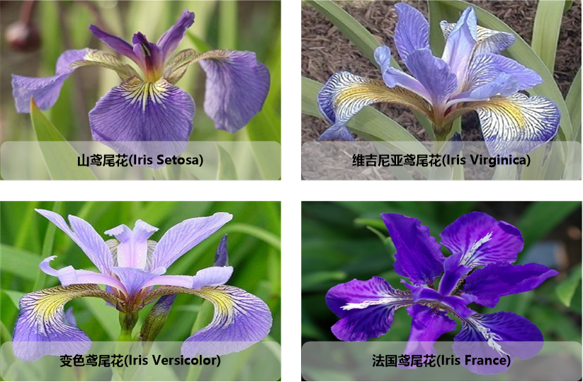

# 机器学习-71:初探机器学习的数据集(含sklearn源码)

> [机器学习原理与实践(开源图书)-总目录](https://blog.csdn.net/shareviews/article/details/83030331)

## 1 鸢尾花(iris)数据集-机器学习的helloworld

鸢尾花(yuānwěi)数据集是源自20世纪30年代的经典数据集。它是用统计进行分类的鼻祖。数据包含三个亚属:山鸢尾花(Iris Setosa)、变色鸢尾花(Iris Versicolor)和维吉尼亚鸢尾花(Iris Virginica)。鸢尾花具有四个特征：花萼长度(cm)、花萼宽度(cm)、花瓣长度(cm)、花瓣宽度(cm)，这些形态特征在过去被用来识别物种。



鸢尾花(iris)数据集的数据特征: 每个样本具有4个特征(sepal length, sepal width, petal length, petal width),特征的单位是cm。一共150个样本。

### 1.1 鸢尾花(iris)数据集操作示例

代码文件位置：../../code-ml/code-sklearn/70-ml-sklearn-dataset.py

``` python
from sklearn.datasets import load_iris
from matplotlib import pyplot as plt

iris = load_iris()

print(iris.keys())
print("iris.keys()  = {0}".format(iris.keys()))

data = iris['data']
print("iris.data.shape  = {0}".format(data.shape))

feature_names = iris['feature_names']
print("data.feature_names  = {0}".format(feature_names))

target = iris['target']
print("data.target.shape = {0}".format(target.shape))

def plot_iris_projection(x_index, y_index):
    # plt.scatter one type of iris flower with one color.
    types_count = 3
    for t,marker,c in zip(range(types_count),'>ox', 'rgb'):
        plt.scatter(data[target==t,x_index],
                    data[target==t,y_index],
                    marker=marker,c=c)
    plt.xlabel(feature_names[x_index])
    plt.ylabel(feature_names[y_index])

pairs = [(0,1),(0,2),(0,3),(1,2),(1,3),(2,3)]
for i,(x_index,y_index) in enumerate(pairs):
    plt.subplot(2,3,i+1)
    plot_iris_projection(x_index, y_index)
plt.show()
```

### 1.2 鸢尾花(iris)数据集图示


## 2 Toy数据集

| Function | Note |
|:----:|:----|
|load_boston([return_X_y])|Load and return the boston house-prices dataset (regression).|
|load_iris([return_X_y])|Load and return the iris dataset (classification).|
|load_diabetes([return_X_y])|Load and return the diabetes dataset (regression).|
|load_digits([n_class, return_X_y])|Load and return the digits dataset (classification).|
|load_linnerud([return_X_y])|Load and return the linnerud dataset (multivariate regression).|
|load_wine([return_X_y])|Load and return the wine dataset (classification).|
|load_breast_cancer([return_X_y])|Load and return the breast cancer wisconsin dataset.|

## 系列文章

- [深度学习原理与实践(开源图书)-总目录](https://blog.csdn.net/shareviews/article/details/83040730)
- [机器学习原理与实践(开源图书)-总目录](https://blog.csdn.net/shareviews/article/details/83030331)
- [Github: 机器学习&深度学习理论与实践(开源图书)](https://github.com/media-tm/MTOpenML)

## 参考资料

- [1] 周志华. 机器学习. 清华大学出版社. 2016.
- [2] [日]杉山将. 图解机器学习. 人民邮电出版社. 2015.
- [3] 佩德罗·多明戈斯. 终极算法-机器学习和人工智能如何重塑世界. 中信出版社. 2018.
- [4] [sklearn数据集官方文档](http://scikit-learn.org/stable/datasets/index.html)
